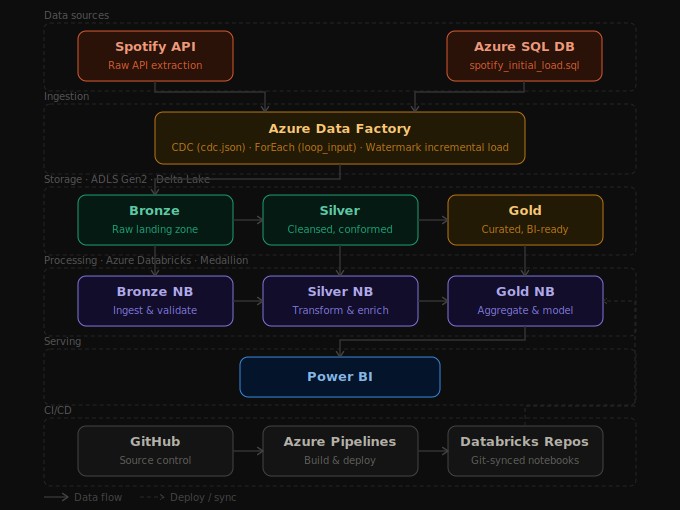

# Azure-DataBricks-DE-Project (Spotify Data)

## 🏗️ Project Architecture

This is an end-to-end data engineering pipeline that pulls music data from the **Spotify API**, processes it through **Azure** services, and delivers analytics-ready insights in **Power BI**.

### How it works

| Stage | Tool | What happens |
|---|---|---|
| **Data Source** | Spotify API + Azure SQL DB | Raw data is extracted from Spotify and loaded into SQL using `spotify_initial_load.sql` |
| **Ingestion** | Azure Data Factory | ADF orchestrates incremental loads using CDC (`cdc.json`), loops over tables (`loop_input`), and tracks progress with a watermark |
| **Storage** | ADLS Gen2 + Delta Lake | Data is stored in three medallion layers — Bronze (raw), Silver (cleaned), Gold (aggregated) |
| **Processing** | Azure Databricks (PySpark) | Three notebooks process data layer by layer: ingest → transform → model |
| **Serving** | Power BI | Dashboards connect directly to Gold Delta tables for business insights |
| **CI/CD** | GitHub + Azure Pipelines + Databricks Repos | Code is version-controlled in GitHub, deployed via Azure Pipelines, and synced into Databricks Repos automatically |

### Tech Stack
`Spotify API` · `Azure Data Factory` · `Azure SQL Database` · `Azure Data Lake Storage Gen2` · `Delta Lake` · `Azure Databricks` · `PySpark` · `Power BI` · `GitHub Actions` · `Azure Pipelines`
